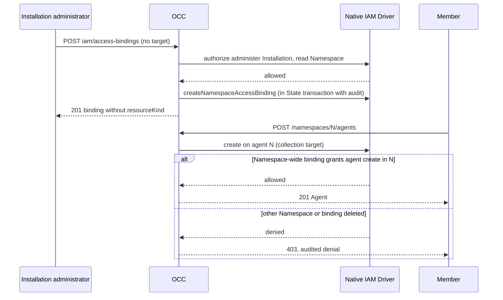

# Proposal: Delegate Agent creation in a Namespace

- **ID:** RFC-0044
- **Owner:** freeqaz (proposal). Decision: OCE maintainers who own IAM.
- **Created:** 2026-10-01
- **Last updated:** 2026-10-01
- **RFC PR:** this PR, marked "Needs human review before landing"
- **Related:** [RFC 31 basic RBAC](31-basic-rbac/index.md) (deferred direction);
  [Namespace IAM policy flow](../../docs/flows/namespace-iam-policy.md);
  [Authorization reference](../../docs/reference/authorization.md)

<a id="problem-and-decision"></a>

## Summary

An Installation administrator cannot let anyone else create Agents, Secrets or
Configurations in a Namespace, and a person who may read and deploy an Agent
cannot read the revisions they deploy. This RFC proposes two small changes to
native IAM. First, the Namespace IAM API accepts an AccessBinding with no target,
which native IAM already evaluates as a Namespace-wide binding: its Role applies
to every resource in that one Namespace, including creation. Second, `read` on an
exact Agent also grants `read` on that Agent's revisions. Existing bindings keep
their meaning. The draft in this PR implements the first change only.

## Motivation

A dogfood session tried to share a Namespace with a teammate so she could create
her own Agents. It is impossible today:

- Creation is authorized against the Namespace collection: `createAgent` checks
  `create` on `{ kind: "agent", id: <namespaceId> }`
  (`operationTarget` in `apps/controller/src/index.ts`). Only an Installation-wide
  or Namespace-wide binding can match that target.
- The Namespace IAM API requires an exact target (`CreateIAMAccessBindingBody`), and
  a bound Role applies only permissions whose kind equals the target kind
  (`evaluateValidatedAuthorization` and `effectiveGrants` in `packages/iam`). A
  `namespace` target carries only `namespace:read`.
- The member saw **Create Agent**, then "Installation capabilities unavailable.
  Access denied" and a 403 on `POST agents`, `configurations` and `secrets`.
  The console's Create page reads `GET /installation`, which needs
  `installation:read`, which no Namespace binding can grant.

Revisions have the same exact-target problem. `getAgentRevision` and
`getAgentDeployment` check `read` on `{ kind: "agent_revision", id: <revisionId> }`.
An Agent `read` grant does not cover them, so every new deployment needs its own
binding. A member who deployed v2 got `202`, then `403` reading it, and the console
kept showing "v1 · Succeeded".

Native IAM already supports Namespace scope. The [design](../../docs/design/access.md)
lists Installation, Namespace and exact-resource bindings. The evaluator treats a
binding with `namespaceId` and no target as covering every resource in that
Namespace. Test fixtures use this, and PostgreSQL stores it (nullable
`resource_kind`/`resource_id` with a pair check). Only the managed API refuses to
create one.

<a id="scope"></a>

## Goals

1. An Installation administrator can grant one person "create and manage Agents,
   Configurations and Secrets in Namespace N" with one Role and one binding, and
   revoke it by deleting that binding.
2. The grant never reaches another Namespace, the Installation, or policy
   administration.
3. A person with `read` on an exact Agent can read that Agent's revisions and
   deployment status.
4. No existing binding grants more after upgrade.

## Non-goals

- RFC 31's fixed role catalog, creator collections, ownership profiles and Groups.
  This RFC is the 0.x step and does not replace that direction.
- Letting non-administrators manage policy. Every Namespace IAM write still
  requires Installation `administer`.
- Console UI for Namespace-wide grants. The HTTP API and CLI cover them first.

<a id="design"></a>

## Proposal

### 1. Namespace-wide AccessBindings (draft implemented)

`POST /namespaces/{namespaceId}/iam/access-bindings` makes `resourceKind` and
`resourceId` optional as a pair:

```json
{ "subjectKind": "identity", "subjectId": "<principal>", "roleId": "<role>" }
```

- Both present: unchanged exact-resource binding.
- Both absent: a Namespace-wide binding (`namespaceId` set, no target), stored
  and evaluated exactly as native IAM already handles that shape.
- Exactly one present: rejected, as other invalid targets are.

Admission is unchanged. OCC requires Installation `administer` and `read` on the
exact Namespace, and holds both through COMMIT (`holdIAMPolicyAuthority`). There is
no target to verify or read. The audit event names the Namespace as its resource;
`bindingAuditResource` already did this for bindings without a target.

A typical delegation Role is `namespace:read` plus `create/read/update` on
`agent`, `configuration` and `secret`. Add `deploy`/`operate` on `agent` to let the
person run Agents, and `agent_revision:read` and `preset:read` to cover revisions
and the seeded Presets in that Namespace.

### 2. Agent read covers its revisions (proposed, not in the draft)

Revision requests gain the parent Agent. `ResourceRef` gets an optional
`agentId`, set by OCC only for `agent_revision` targets. OCC already resolves the
Agent from the route before it authorizes a revision. Native IAM allows `read` on
a revision when either:

- a binding grants `agent_revision:read` for it (today's rule), or
- `read` on `{ kind: "agent", id: agentId }` is allowed, including that request's
  Restrictions, and no Restriction matches the revision request itself.

Only `read` is derived. Drivers that ignore `agentId` keep today's exact behavior,
so they stay closed rather than becoming more permissive.

A revision embeds its Configuration snapshot (`configuration`, `secretBindings`),
but Agent `read` alone does not grant reading that Configuration. Agent sharing
deliberately denies it today. A derived read therefore returns revision metadata
and deployment status, plus the snapshot only when the caller can also read the
revision's exact Configuration. A direct `agent_revision:read` grant keeps
returning the full revision.

### Request lifecycle



The first half is implemented by the draft. The second half is the existing
create path, unchanged.

## Security analysis

- **Blast radius.** A Namespace-wide binding grants its Role on every current and
  future resource of the listed kinds in that Namespace, including other people's
  Agents and Secrets. This is broader than RFC 31's exact companions and is the
  main thing reviewers must accept. Administrators limit it through the Role's
  permissions. `secret:read` exposes metadata only; using a Secret needs `operate`.
- **Containment.** Managed Roles are Namespace-scoped, and binding validation
  requires the Role, binding and subject to share the path Namespace. The
  evaluator drops any request whose resource Namespace differs. Managed Roles
  cannot contain `installation` permissions, and `namespace` permissions are
  `read` only. A Namespace-wide binding therefore cannot reach the Installation,
  Namespace deletion or IAM policy routes.
- **Key issuance.** Minting a service API key requires the caller to cover every
  grant of the target (`coversIdentityAccess`). `grantCovers` already compares
  Namespace-wide scope correctly.
- **Restrictions.** Deny-only Restrictions apply to Namespace-wide grants and to
  derived revision reads, as they do today.
- **Revocation.** Deleting the binding denies the next request on any replica.
  As with exact bindings, it does not stop running Agents or revoke upstream
  credentials.
- **Derived revision read.** Deriving the full revision would expose the
  Configuration snapshot to people who may read only the Agent. Change 2 therefore
  derives metadata and status only, as described above. Secret values are never
  part of a revision.

## Migration and compatibility

- **Existing bindings.** No existing binding changes meaning. The managed API could
  not create a Namespace-wide binding before, so new behavior applies only to new
  bindings. Rejected alternative A below would instead have widened existing
  Namespace-target bindings.
- **Schema.** No migration. `occ.iam_access_bindings` already allows a null target
  pair.
- **API.** Additive: two request fields become optional. Responses already allow
  a binding without a target (`IAMAccessBindingSchema` union). Clients that assume
  every listed binding has a target must handle its absence. The console's
  sharing panel filters on `resourceKind === "agent"` and is unaffected.
- **External IAM Drivers.** They receive the same `createNamespaceAccessBinding`
  input without target fields and may reject it; OCC surfaces that as today. For
  change 2, they may ignore `agentId`.
- **Derived revision read.** Existing per-revision bindings keep working and become
  redundant for readers of the Agent. Removing them is optional.

<a id="alternatives-and-open-decisions"></a>

## Rationale and alternatives

- **A. A `namespace`-target binding also grants child-kind permissions.** This
  changes no API, but it silently widens existing bindings. Nothing stops a Role
  that mixes kinds from being bound to both the Namespace and one Agent; the
  integration tests bind `{namespace:read, agent:read}` that way. Under A, such a
  binding would start granting its Agent permissions on every Agent in the
  Namespace. Rejected.
- **B. Creator collections and ownership profiles (RFC 31).** Grant only
  `agent:create` on the Namespace collection. Creation then atomically grants the
  creator exact roles on the new Agent and its revisions. This is narrower and
  better for multi-tenant teams, but it needs new State writes inside creation, a
  profile model, and console work. It remains the long-term direction; this
  proposal does not block it.
- **C. Grant the deployer read on each revision they create** (D94). This is
  narrower than change 2 but still leaves other readers of the Agent without
  history, and it adds policy writes to the deploy path. Rejected in favor of
  deriving from Agent `read`.
- **D. Keep current behavior** and document that only Installation administrators
  can create. This is the fallback if this RFC is declined; the docs should then
  say so.

## Delivery and verification

1. **Namespace-wide bindings.** The draft in this PR covers contracts, native IAM
   input validation, OCC admission, in-memory and PostgreSQL State, and docs.
   - `tests/integration/postgres-production-wireup.test.mjs` exercises the real
     production composition over PostgreSQL with cookie sessions. A no-grant
     person is denied, receives one Namespace-wide binding, then creates a
     Secret, a Configuration and an Agent and reads the Agent. They are still
     denied Installation read and policy administration, and are denied creation
     again after the binding is deleted.
   - `tests/integration/occ-api.test.mjs` checks the API shape, the partial-target
     rejection and the audit resource.
2. **Console capabilities.** The Create page needs Installation capabilities
   without `installation:read`, for example a capability summary on a
   Namespace-scoped read. This is a separate API change with its own review.
   Until then, the guide says the console needs Installation `read` too.
3. **Derived revision read (change 2).** Add `agentId` to revision
   `ResourceRef`s in OCC and the worker, and add the derived rule plus its
   Restriction checks to native IAM. Integration proof: an exact-Agent reader
   deploys and reads the new revision and deployment status, and a Restriction on
   `agent_revision:read` still denies.

Not verified: an external IAM Driver; the console Create flow for a delegated
member (blocked by step 2); a live installation.

## Unresolved questions

- **Is Namespace-wide scope acceptable for 0.x,** or must delegation wait for
  RFC 31's exact creator profiles? Decider: IAM owners. Until then, the draft
  must not land.
- **Should change 2 also derive deployment-status read from Agent `deploy`?**
  The current proposal derives only from `read`. Decider: IAM owners.
- **Shape of the metadata-only revision.** The existing metadata variant signals
  unreadable stored data (`configurationReadError`), not missing permission. A
  derived read needs its own marker. Decider: API owners, with change 2.
- **Console exposure.** Should the sharing panel offer "Can create in this
  Namespace"? Decider: product owner, after the API decision.

## References

- Dogfood findings D92 and D94 (round 5 on `main` at `cc06ec34b`).
- `packages/iam/src/index.ts`: `evaluateValidatedAuthorization`, `effectiveGrants`,
  `managedAccessBinding`.
- `packages/occ/src/index.ts`: `createIAMAccessBinding`, `holdIAMPolicyAuthority`,
  `getRevision`.
- `apps/controller/src/index.ts`: `operationTarget`, `requiredPermissions`.
