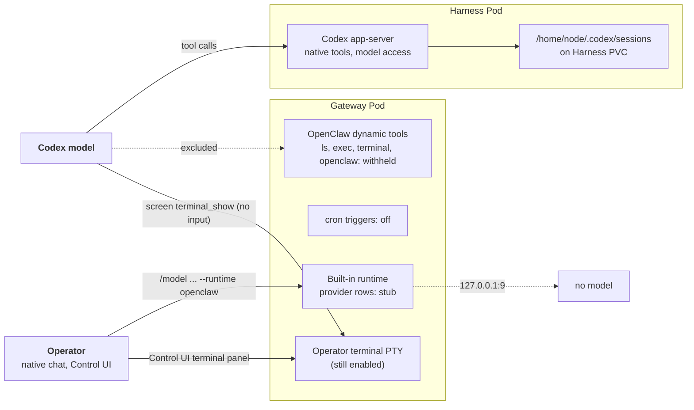

# Proposal: Keep dedicated Codex Gateways from acting on their own Pod

- **ID:** RFC-0046
- **Owner:** freeqaz (implementation PRs). Decision review: maintainers of the Kubernetes Compute Driver and the Harness runtime.
- **Created:** 2026-10-01
- **Last updated:** 2026-10-03
- **RFC PR:** [#853](https://github.com/openclaw/openclaw-enterprise/pull/853)
- **Implementation:** landed [#808][pr-808], [#814][pr-814], [#824][pr-824]; open [#830][pr-830]. Follow-ups: [#874][pr-874], [#895][pr-895], [#896][pr-896]. Related Harness hardening: [#765][pr-765], [#796][pr-796].
- **Related:** [Gateway–Harness storage split](28-gateway-harness-storage-split.md), [Harness authentication bindings](30-harness-auth-binding.md), [Dedicated Harness RWO workspace plan](../plans/38-harness-rwo-workspace-plan.md), [Workspace files flow](../../docs/flows/workspace-files.md).
- **Source baseline:** `main` at `04d01d02e`; OpenClaw runtime pin `9d9c8568c` (`deploy/runtime/Dockerfile`).

## Summary

A dedicated Codex Agent with a workspace node runs two Pods. Codex, its
workspace and its model access live in the Harness Pod. The OpenClaw Gateway
Pod only orchestrates: it routes chat, holds the transcript, and reaches the
Harness workspace through the paired node. Its own `/home/node/workspace` is
empty. The decision recorded here: **on these Gateways, nothing the model can
call may read, write or execute in the Gateway Pod, and OpenClaw's built-in
runtime, which runs in the Gateway process, has no reachable model.** The
runtime entrypoint enforces this by rewriting the owner's OpenClaw config at
every Gateway start. Codex thread state moves to the Harness volume so threads
survive a restart.

This is a retroactive record. Reviewers should accept or revise the landed
design and decide the open continuation, #830.

## Context

Dogfooding found the Gateway acting on its own Pod (findings D74 and D86-D90
in the OCE dogfood log):

- **D74.** OpenClaw dynamic tools such as `ls` run in the Gateway process, so
  `ls` listed the Gateway's empty workspace and the model reported existing
  files as missing; `gateway_exec` ran commands in the Gateway Pod. Codex
  rollouts lived in Pod-local `/home/node/.codex/sessions`, so a stop/start
  lost the thread.
- **D86.** After #808, the model could still reach a Gateway shell three ways:
  the `terminal` tool typed into an operator terminal (a Gateway-local PTY) with
  no approval under the native chat's default Full Access policy; the `openclaw`
  config delegate's `config.set` removed the tool exclusion and the change
  hot-applied; and an `automations` stream schedule ran `sh -c` in the Gateway Pod.
- **D87, D89, D90.** The built-in `openclaw` runtime executes in the Gateway with
  Gateway-local `exec`/`read`/`write`. The model cannot select it (source and
  live). An operator can, with `/model <ref> --runtime openclaw`, and Codex
  itself hands every turn to it when a provider route has request transport
  overrides or the config has authored request `params`.

## Decision as landed

Enforcement lives in the Gateway wrapper generated by
`apps/controller/src/drivers/compute/kubernetes/runtime-entrypoints.ts`. When
the Gateway has a workspace node (`OPENCLAW_WORKSPACE_NODE_ID` or
`OPENCLAW_WORKSPACE_NODE_PATH` is set), it calls `excludeGatewayLocalCodexTools`
before writing `openclaw.json`. Gateways without a workspace node keep their
config. Without a Codex plugin entry, only the provider pin (item 3) applies, and
only when `APP_SERVER_URL` names a remote Codex Harness.

1. **Withhold Gateway-local tools from Codex (#808, #814).**
   `GATEWAY_LOCAL_CODEX_DYNAMIC_TOOLS` (`ls`, `read`, `write`, `edit`,
   `apply_patch`, `exec`, `process`, `gateway_exec`, `gateway_process`,
   `terminal`, `openclaw`) is merged into the Codex plugin's
   `codexDynamicToolsExclude`, keeping owner entries. Codex's native tools act
   in the Harness, and the file-transfer tools reach the workspace through the
   node. `openclaw` is excluded because its `config.set` could drop this list.
2. **Turn off automation triggers (#814).** `cron.triggers.enabled` is forced to
   `false`: stream schedules, script payloads and condition scripts run in the
   Gateway process. Timed automations still run Codex turns in the Harness.
3. **Give the built-in runtime no model (#824).** `pinCodexProviderTransport`
   rewrites every `codex` and `openai` provider row (keys matched after trim and
   lowercase). Only model-naming, limit/cost and `agentRuntime` fields survive
   (`CODEX_PROVIDER_KEPT_KEYS`, `CODEX_MODEL_KEPT_KEYS`); `request`, `headers`, `params`, `localService`,
   credentials and per-model transport fields are dropped. An authored transport,
   and always the `codex` row, becomes `CODEX_PROVIDER_STUB_URL`
   (`http://127.0.0.1:9`, `api: openai-responses`). A missing `codex` row is
   added because `codex` is a bundled provider. An `openai` row with no authored
   transport keeps OpenClaw's default, which has no credential in the Gateway
   unless the Configuration's `env`/`env.vars` supplies one (that provider reads
   `CODEX_API_KEY` or `OPENAI_API_KEY`); a literal `CODEX_API_KEY` is admitted
   today.
   With transport overrides gone, those rows no longer make Codex declare
   `fallbackRuntime: "openclaw"`.
4. **Persist Codex threads on the Harness volume (#808).** In
   `apps/controller/src/drivers/compute/kubernetes/index.ts`,
   `HARNESS_CODEX_SESSIONS_CATEGORY` mounts subPath `codex-sessions` of the
   Harness claim at `/home/node/.codex/sessions` for non-OAuth logins
   (`harnessWorkspaceCategories`). OAuth logins already keep all of
   `CODEX_HOME` in `codex-home`; the init step removes `codex-sessions` for an
   OAuth revision and `codex-home` for a non-OAuth one. The changed Deployment
   template is expected to roll existing Harness Pods once on a controller
   upgrade; a stop/start on a controller built from #808 was not verified.
5. **Report the rewrite and refuse what it cannot apply (#874, #895, #896).**
   `logOverriddenSettings` writes one `runtime.gateway_settings_overridden`
   stderr event at start naming, never valuing, the replaced settings.
   `occ agent logs` shows it as a warning; the Collector exports only the event
   name, as WARN. Deployment admission runs `requireCodexGatewayConfigurationShape`
   for dedicated Codex and refuses a shape the entrypoint cannot rewrite with
   400 `INVALID_REQUEST` naming the setting path: a non-list
   `codexDynamicToolsExclude`, a non-object Codex plugin `config`, `cron`,
   `cron.triggers`, `models` or `models.providers`, or a `codex`/`openai` row
   that is not an object or whose `models` is not a list of objects. The
   entrypoint still fails the start on such a block admitted before #874.

Related Harness-side hardening landed in the same window:

- **#765.** `codexChildEnvironment()` removes `APP_SERVER_TOKEN` from the
  environment of `codex login` and `codex app-server`. The wrapper still holds
  the token for plugin authentication and gives the listener only its SHA-256.
  This reduces ambient inheritance by model-run commands; it does not isolate
  same-UID processes or remove the token from the Pod.
- **#796.** The Codex OAuth seed writer mounts only subPath `codex-home` of the
  Harness claim. A `prepare-oauth-home` init container first creates it as uid
  1000 with mode `0700`, replacing a planted link or file; a kubelet-created
  subPath came out `root` mode `2777`.

Solid arrows are implemented and reachable; dashed arrows are cut by the
landed changes.

## Threat model

**Model-driven paths** are the ones this design must close, because a prompt
injection in any file or web page reaches them. After #808 and #814:

- The model has no Gateway-local file, shell or terminal tool, and cannot edit
  the Gateway config: the `openclaw` delegate is excluded, and the `gateway`
  tool offers `config.get`, `config.schema.lookup` and `update.run` on an owner request or operator schedule.
- It cannot start a non-Codex run. `sessions_spawn` and `subagents` stay
  callable, but every spawn resolved to `codex/<model>`; other refs fail
  `model not allowed` against the allowlist seeded from configured provider rows.
- It cannot set a session runtime override. No agent tool writes
  `agentRuntimeOverride`; live attempts through `session_status`, `sessions_send`,
  `sessions_spawn` and `sessions` patch were all refused (D89).

**Operator-driven paths** need native chat or Configuration access, which is
already admin-level on that Agent:

- `/model <ref> --runtime openclaw` switches a session to the built-in runtime.
  OpenClaw's `AgentRuntimePolicySchema` is strict `{ id }`, and
  `resolveCompatibleAgentRuntimeForProvider` accepts `openclaw` for any
  provider, so no config can forbid it. #824 makes that run fail against the
  stub for `codex` and `openai` rows (live: the model proxy logged no request).
- The operator can open a terminal from the Control UI panel, a `bash -l` child
  of the Gateway process. OCE sets nothing under `gateway.terminal`, and OpenClaw
  enables it unless `gateway.terminal.enabled` is `false`
  (`isTerminalConfigEnabled`). The model-callable `screen` tool is not excluded,
  so `screen terminal_show` can still make the operator's browser open that
  panel and its PTY. Codex cannot type into it (`terminal` is withheld, #814),
  but the operator has a Gateway shell.
- The rewrite runs only at Gateway start. A later config change, which
  OpenClaw hot-reloads (seen live with `config.set` in D86), is not re-checked
  until the next start. The model can no longer make such a change; an
  operator with Gateway config write access can.

So an operator can already reach the Gateway Pod. The provider pin keeps a
misconfigured Configuration from turning that into a model with Gateway tools.

## Verification

The PRs add conformance cases (`tests/conformance/plugin-runtime-policy.test.mjs`,
and `kubernetes-compute.test.mjs` for #808) and extend the runtime-image check
(`tests/integration/runtime-image-startup.test.mjs`) against the pinned OpenClaw
image. Live checks ran on a dogfood install in throwaway Namespaces:

- #808 on `769c8cd88`: no Gateway-local tools, and the thread resumed after
  stop/start.
- #814 on `f22a584e6`: the Gateway config lists the eleven exclusions and
  `cron.triggers.enabled: false`; a stream schedule was refused by the tool
  schema; no shell child appeared in the Gateway.
- #824: applied by hand to a running Gateway's config (the shared controller was
  not upgraded). Normal turns stayed on the Harness; an operator
  `--runtime openclaw` turn hit only the stub.

The `openai` default-transport case was not run live.

## Alternatives considered

- **Mount the Harness workspace in the Gateway.** Rejected by the storage split
  (RFC 28): the workspace is RWO on the Harness, and Gateway tools would still
  run with Gateway credentials and network.
- **Route the tools through the node.** OpenClaw runs these tools in the
  Gateway process; rerouting each one would be upstream work. Codex's native
  tools already cover the same operations in the Harness.
- **Reject unsafe Configurations at admission.** Admission checks only part of
  OpenClaw's config (`resolveConfiguredHarnessId` does not read
  `agents.defaults.modelPolicy`), and every new key would need a rule there
  too. Rewriting at Gateway start also covers config that was admitted earlier.
  Since #874 admission refuses only shapes the rewrite cannot handle; a
  well-formed unsafe setting is still admitted and then rewritten.
- **Persist all of `CODEX_HOME` for non-OAuth logins.** It holds the login; the
  revision's credential should stay Pod-local and be re-delivered. Only
  `sessions` is needed for resume.

## Known gaps and residual risk

- **Other provider rows and request params (#830, open).** #824 pins only
  `codex` and `openai`. A Configuration that adds another row with a credential
  (`apiKey: "${VAR}"` from a Secret binding) plus an allowing
  `agents.defaults.modelPolicy` (admission does not check it) gives an operator's
  built-in run a reachable model; the Gateway NetworkPolicy was the only barrier
  live. Any non-empty `agents.defaults.params`, agent `params` or non-run-control
  model `params` make `hasAuthoredProviderRequestParams` true, so Codex declares
  the fallback and every normal turn fails closed in the Gateway. The workspace
  files flow says "Codex never hands that runtime a turn", which is true only
  for provider rows. The default `openai` row can also pick up a credential
  from Configuration `env`/`env.vars`: admission forces only `OPENAI_API_KEY`,
  `ANTHROPIC_API_KEY`, `ANTHROPIC_AUTH_TOKEN` and `CODEX_ACCESS_TOKEN` to be
  `${VAR}` references, so a literal `CODEX_API_KEY` passes, and an
  `OPENAI_API_KEY` reference can resolve from a Secret binding. #830 strips
  `OPENAI_*`, `CODEX_*` and `ANTHROPIC_*` names from `env` and rejects every
  `CODEX_*` name at admission.
- **#830 is open-ended.** It stubs every provider row, forces an explicit
  `modelPolicy.allow`, strips params and model-credential env names, drops
  `channels.modelByChannel`, and stubs providers named by image, PDF, utility
  and hook models. Automated review found that it widens an alias-only
  allowlist (an `allow` of aliases is filtered to empty, then replaced by every
  selected model); that is still true at head `4916f264c`. Keys
  such as `mediaModels`, `voiceModel`, heartbeat or compaction models and cron
  job models are still uncovered. Each new OpenClaw model key is another rule.
- **Operator terminal.** The Control UI terminal panel still opens a Gateway
  shell, and the model can still open it in the operator's browser through
  `screen terminal_show` (without input).
- **Memory flush.** Per #808, upstream memory-flush runs use OpenClaw
  `read`/`write` regardless of `codexDynamicToolsExclude`. Not checked on
  dedicated Codex.
- **Rewrite warns, not refuses.** Admission accepts a well-formed setting the
  entrypoint will drop. The owner learns of it only from the
  `runtime.gateway_settings_overridden` warning at start; no Agent condition
  records it.
- **Upstream drift.** The exclusion list and kept-key sets match OpenClaw
  `9d9c8568c`; new upstream tools or transport fields need matching changes.

## Open questions for reviewers

1. **How should the built-in runtime be closed?** Options: (a) land #830's
   config rewrite after fixing alias handling; (b) ask upstream for an
   `agentRuntime` setting that disables fallback and rejects session runtime
   overrides (recorded as upstream ask OC1), then delete the pin; (c) disable
   session runtime overrides and the operator terminal on dedicated Gateways;
   (d) accept the operator-only risk and keep #824. **Implemented today:** (d),
   #824 only.
2. **Should operator terminals open in the Gateway Pod?** Setting
   `gateway.terminal.enabled: false` on workspace-node Gateways would remove the
   operator shell. **Implemented today:** terminals enabled (OpenClaw default).
3. **Should Gateway-local provider features keep working?** #830 would stop
   image, PDF, utility and hook models whose provider is not `openai` on these
   Gateways. **Implemented today:** they keep their rows unless the provider is
   `codex` or `openai`.
4. **Should dropped settings be surfaced** (log line or Agent condition)?
   **Implemented today:** a `runtime.gateway_settings_overridden` warning with
   setting names at each start, no Agent condition; admission refuses shapes
   the rewrite cannot handle with a 400.
5. **Should `agents.defaults.params` be refused at admission?** It cannot work
   on these Agents. **Implemented today:** admitted; every Codex turn then fails
   in the Gateway.

[pr-765]: https://github.com/openclaw/openclaw-enterprise/pull/765
[pr-796]: https://github.com/openclaw/openclaw-enterprise/pull/796
[pr-808]: https://github.com/openclaw/openclaw-enterprise/pull/808
[pr-814]: https://github.com/openclaw/openclaw-enterprise/pull/814
[pr-824]: https://github.com/openclaw/openclaw-enterprise/pull/824
[pr-830]: https://github.com/openclaw/openclaw-enterprise/pull/830
[pr-874]: https://github.com/openclaw/openclaw-enterprise/pull/874
[pr-895]: https://github.com/openclaw/openclaw-enterprise/pull/895
[pr-896]: https://github.com/openclaw/openclaw-enterprise/pull/896
