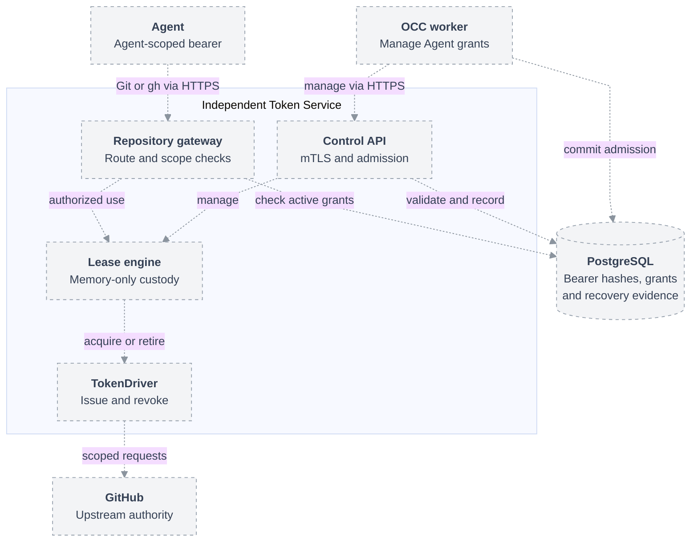

# Independent Token Service deployment

Deploy one active Token Service per Installation, separately from OCC workers.
Workers manage grants over authenticated HTTPS. Agents send Git/`gh` traffic
directly to its gateway using opaque Agent-scoped bearers; the worker never proxies
that traffic. TokenDrivers and upstream credentials remain inside the service.
This is the proposed deployment contract for [RFC-0056](index.md).

## Topology

Dashed connections show the proposed integration, not implemented behavior.

The authenticated metadata caller uses the same control API with its separate
admission kind. It receives metadata results, never token material.

## Control authentication and configuration

Use separate control and gateway listeners, certificates, and network policies.
Only provisioned OCC callers can reach control; Agent networks can reach only
the gateway. Network reachability does not grant authority.

Control requires mTLS with a configured client CA and exact certificate URI SAN
matching a `control.clients[].identity` entry. `admissionKinds` limits that
identity's operations to Agent or Installation-operation leases. URI values
are identifiers; this does not require a SPIFFE deployment. Reject unknown
identities, wrong admission kinds, invalid certificates, and gateway bearers on
control. Lease status and closure enforce the same owner and Installation
boundaries as admission. The bounded description operation requires an
Installation-operation admission; it cannot return lease credentials.

The `drivers.repo.configuration.controlClient` files are process-local mounts:
worker and API processes receive distinct certificates with their respective
configured identities, even when file paths match. The client verifies the
control server's hostname and CA. The service alone mounts control-server keys,
issuer keys, and its state database credential. Project configuration so workers
and API processes receive only their own private inputs and the nonsecret authority
configuration used to compute `configurationDigest`.

mTLS identifies a caller; it does not authorize arbitrary grants. OCC performs
IAM checks and commits a bound admission before calling control. The service
compares that record's owner, admission kind, `configurationDigest`, selected
grant and exact authority, authorization generation, any bounded-operation
deadline, and current eligibility with the request and active configuration. Installation metadata
admission also records the requesting principal, Namespace, and exact approved
repository set; the service manages its internal leases through
`describeRepositories`, without exposing a metadata lease handle. Reject
missing, mismatched, expired, or withdrawn authority. Required validation and
receipt writes fail closed when their state is unavailable.

## Agent bearer authentication and lifetime

The managed gateway validates an opaque bearer and resolves its Agent owner.
Keep the current cryptographically random bearer and SHA-256 verification,
but persist the verification record instead of relying on a process-local map;
never accept a caller-supplied Agent ID as identity evidence. The bearer maps to
one `(installationId, namespaceId, agentId)`, not a revision or an upstream token.
No Agent client certificate, SPIFFE identity, Pod-bound token, or other workload
identity check is required. Server-authenticated HTTPS remains mandatory.

After authentication, check the Agent's active admission and resolve the requested
repository within its current grants. Verify the configuration digest, selected
binding generation, and operation permissions. Draft changes grant nothing.
Perform these checks for each request, including on existing connections, and
deny dispatch if required state is unavailable. Possession authenticates the
Agent but does not freeze obsolete permissions or bypass stop/deletion.

Managed bearers have no session-duration expiry. Agent stop, deletion, or explicit
revocation invalidates them durably; service restart does not; revoking one repository grant
need not invalidate the bearer for remaining admitted repositories. Revoke old
grant authority before activating replacement grants. Certificate rotation and
SPIRE availability are irrelevant to this first-delivery authentication path.

Compute owns the existing protected credential artifact, now at Agent scope,
and retains/reprojects it across eligible revision updates. Client configuration
still selects and pins a particular admitted binding generation. Persist the
admission and binding before releasing a new bearer, return it only once, and
never regenerate it through status. Serialize bearer creation/replacement per
Agent; admitting another repository grant does not mint another Agent bearer. Losing the response or credential artifact
requires explicit revocation/replacement and delivery through the authorized
worker path; do not mint credentials on a client's unauthenticated request.

Only one workload instance may act for an Agent during handover. OCC disables
the old admission; Compute must terminate or fence the retired workload and its
access to the Agent credential before activating replacement grants. Unknown
termination blocks handover. Bearer validation does not independently prove which
instance sent a request: a copied bearer can impersonate the Agent while valid.
This is an explicit bearer-model limitation, not workload-bound authentication.

## Future workload-identity authentication

Future work may replace Agent bearers with mTLS using the stable OCC-owned
[Agent WorkloadIdentity](../../../docs/design/access.md), for example
`spiffe://<trust-domain>/namespaces/<namespaceId>/agents/<agentId>`.
Revisions would remain configuration provenance, not distinct identities.
[SPIFFE X.509-SVIDs](https://spiffe.io/docs/latest/deploying/svids/) provide
short-lived, rotating identity credentials. Enforcing that identity on every
gateway connection could remove the application bearer; merely authenticating
once to mint an ordinary bearer would not bind subsequent use to a workload.

That work needs attestation and registration, identity/trust-bundle distribution,
rotation, current-instance handover, and a working native Git/`gh` mTLS transport.
[SPIRE supports direct and proxy-based mTLS](https://spiffe.io/docs/latest/spire-about/use-cases/),
but OCE integration is not implemented or included in this delivery. Do not add
SPIRE installation, Workload API mounts, Agent mTLS configuration, or identity
readiness gates now. Retain server TLS and existing worker-to-control mTLS.

## State and recovery

### Durable bearer verification

Persist one managed Agent credential record containing its bearer hash,
`installationId`, `namespaceId`, `agentId`, credential generation, and
active/revoked state. Retain the existing high-entropy random bearer and SHA-256
verification from [session admission](../../../apps/controller/src/drivers/repo/credentials/sessions.ts).
The raw bearer remains only in its protected Compute-owned client artifact and
one-time delivery; neither plaintext nor recoverable ciphertext enters this
record. Treat verification records as restricted authentication metadata, not
public status or audit output. Permissions remain in current admitted grants,
not duplicated in the credential record.

Create the record before releasing the bearer. OCC revokes the Agent credential
in the same database transaction that accepts its authorized stop/delete
transition, including deletion through its Namespace. Serialize this transition
with credential creation/replacement for that Agent so concurrent admission
cannot restore access. This requires no Token Service RPC or availability; a
failed transaction does not acknowledge the transition as accepted.

Every authentication check after that commit rejects the revoked bearer,
including requests on existing connections. The service reconciles closed
leases and cancels owned exchanges separately; already dispatched upstream
operations cannot be undone. Compute shutdown and lifecycle completion do not
wait for upstream-token cleanup. Retain cleanup obligations after Agent deletion.
A later start needs fresh authorized admission and a new bearer; it never
reactivates the old credential.

Replacement atomically revokes the previous generation and records the new hash
before one-time delivery; failed delivery never reactivates the old generation.
Revision updates preserve a valid bearer while updating its admitted grants.
Closing one grant does not revoke the Agent credential for remaining grants.
A separate operator-facing revoke action is deferred.

Revocation survives restart. Every use checks current credential and
authorization state; an in-memory lookup cache cannot conceal revocation.
Missing database state or unavailable required checks deny access. Losing client
material requires explicit credential replacement; a database record cannot
reconstruct it.

### Admission and issuance records

OCC owns Agent activation, grants, retirement intent, and lifecycle-driven
credential revocation. A restricted service role reads these records and manages
credential creation/replacement, bearer verification, reservations, bindings,
issuance attempts, recovery accounting, and terminal receipts. It cannot edit
IAM policy or Agent desired state. Serialize admission by durable identity;
retries return status, never duplicate credentials. Reusing an Agent bearer on
a revision change does not reopen closed authority.

Remove the worker receipt server, reverse callback, shared socket volume, and
coupled shutdown ordering. Record actual cleanup results directly. A failed
receipt write does not establish disposal; closure remains effective while
recording retries. Issued upstream tokens and active HTTP exchanges remain
memory-only. No token encryption key, recoverable token store, or persistent
refresh-token store is added.

Before every managed token acquisition, durably record intent, owner, grant,
issuer identity, service incarnation, and attempt ID. Capture nonsecret outcome,
reported expiry when available, and terminal evidence. A crash between dispatch
and recording a result leaves an unresolved attempt, never an absent obligation.
Retain such records even when no token string was captured. Capture-and-cleanup
handling for late completion remains required while the original process lives.

### Bounded GitHub restart recovery

Worker restart leaves service ownership and Agent credentials unchanged. After a
Token Service restart, the same active bearer authenticates using its durable
record. On the first authorized request needing a token, reconstruct the current
grant context and acquire a fresh GitHub token without rewriting client files or
restarting the Agent, subject to all of these gates:

1. Confirm the previous service instance stopped or is fenced from both gateway
   service and issuer dispatch. A missing heartbeat, failed readiness probe, or
   force-deleted Pod alone is insufficient. Ambiguous ownership blocks takeover.
2. Recheck the bearer, active Agent, admitted binding and current configuration.
   Recovery cannot widen authority or reopen revoked/closed access.
3. Preserve each predecessor attempt and token obligation as unresolved until
   actual revocation, conservative expiry proof, or definitive non-issuance is
   established. Fresh issuance is a separate linked attempt, not replay or proof
   that predecessor cleanup succeeded.
4. Atomically reserve recovery budget and persist the new issuance intent before
   dispatch. Coalesce competing requests for the same grant. Limits and request
   accounting survive service restart, worker replacement, revision changes,
   credential rotation, and configuration reload.

This exception initially applies only to managed Agent grants using the bundled
GitHub App TokenDriver. GitHub documents [one-hour installation-token expiry](https://docs.github.com/en/apps/creating-github-apps/authenticating-with-a-github-app/generating-an-installation-access-token-for-a-github-app).
Lost tokens can remain valid upstream during that period, and the service cannot
revoke them without their material. The policy intentionally allows fresh scoped
issuance despite that debt; it does not label the predecessor `DISPOSED`.

`recovery.minimumIntervalSeconds` spaces recovery dispatches per Agent and grant.
`maximumUnresolvedAttemptsPerAgent` bounds unresolved acquisitions across that
Agent's grants, and `maximumUnresolvedAttemptsPerDriver` bounds them across the
same installed issuer. Before dispatch, existing debt plus reserved possible
issuance must fit both caps. Lost live tokens and uncertain predecessor
acquisitions count; definitively not-dispatched attempts do not. A new reservation
counts until its result and captured custody are recorded. Successfully captured
current tokens use ordinary live-token capacity; a subsequent crash converts
them into predecessor debt before new recovery is admitted. Success never removes
older debt. Normal renewal cannot evade unresolved-debt limits. Preserve
issuer/Agent accounting identity across configuration versions; renaming a Driver
must not erase debt.

A surviving original instance must reconcile its own uncertain acquisition;
it cannot use this exception as an automatic retry. Repeated crashes consume
the durable limits and eventually block further issuance. An exhausted limit
returns explicit temporary unavailability without revoking the Agent bearer.
Rate/cap evaluation is authoritative in shared state; restart does not reset it.
Release debt only with valid terminal evidence; elapsed local timeout, row
absence, process exit, or an untrusted forward clock jump is not expiry proof.
A lost successful token can therefore require operator recovery if expiry
cannot be established conservatively.

Never automatically replay a Git push or API mutation that may have reached its
upstream. Recovery runs before forwarding a new request; a disconnected previous
request still has an uncertain result. Known denial or required reauthorization
is not converted into recovery issuance. Other TokenDrivers, metadata operations,
and standalone sessions keep fail-closed uncertainty handling until separately
specified and proven. Drivers with unbounded or rotating credentials do not
inherit this GitHub-specific recovery policy.

## Deployment and verification

Publish a versioned Token Service image containing the bundled GitHub Driver.
Release packaging must install that image without a user build; local builds
remain a development option. Custom Driver packaging and distribution are
[future work](index.md#future-work).

Ship a separate Deployment and stable Service endpoints, with one active instance
and `Recreate` replacement. Worker scaling must not create more Token Service
instances. Stop the old instance before activating its replacement; ambiguous
termination blocks takeover. Forced deletion or loss of readiness is not proof
that the old process stopped. Multiple active replicas, distributed token caches,
and automatic failover are outside this proposal.

Worker upgrades leave Token Service Pods untouched. Service shutdown denies new
admissions and drains bounded cleanup independently of worker availability.
Service failure interrupts repository access across the Installation; report
that availability limit explicitly. Network policies restrict gateway consumers,
control callers, database access, and issuer egress separately.

Extend real Agent and PostgreSQL integration proof to cover:

- Worker restart with continuing Agent traffic and no replacement issuance.
- Distinct mTLS caller identities; rejection of wrong kinds, unauthorized grants,
  missing admission records, and Agent access to control.
- Concurrent admission, lost responses, database failure, and direct terminal
  receipts without a worker callback.
- Managed access beyond the former session deadline; Agent-scoped bearer reuse
  across revisions with current grants, stale-binding denial, and no workload-identity
  prerequisite. Stop/delete must deny requests on existing connections.
- Stop/delete committed while Token Service is unavailable; rejection of the old
  bearer after restart, fresh bearer delivery on a later start, and concurrent
  admission unable to undo revocation. Closing one grant preserves access to
  other admitted grants; Agent-wide revocation denies all of them.
- Service restart accepting the same managed bearer and acquiring a fresh scoped
  GitHub token without changing Agent files; old cleanup stays unresolved.
- Durable revocation across restart; crash after dispatch but before outcome
  capture; repeated-crash exhaustion of per-Agent and per-issuer caps and the
  persisted rate limit; concurrent first requests reserve only one recovery.
- Ambiguous predecessor termination blocking issuance; no automatic replay of
  uncertain pushes/API mutations; other Drivers and standalone remain fail-closed.
- Installation from release packaging using the published image without a local
  build; service placement, listener separation, enforced network policies, and
  issuer credentials confined to the service.

These are implementation acceptance requirements, not proof delivered by this RFC.
Update the current RepoDriver session/files contract and Compute ownership to
remove managed session-duration assumptions. Standalone sessions keep their
bearers, explicit durations, and existing recovery limits.
